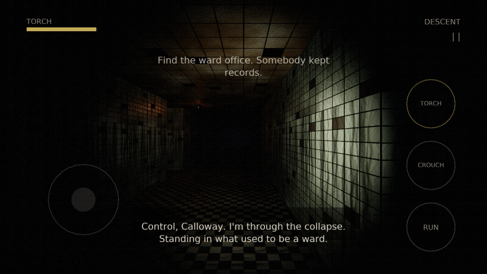
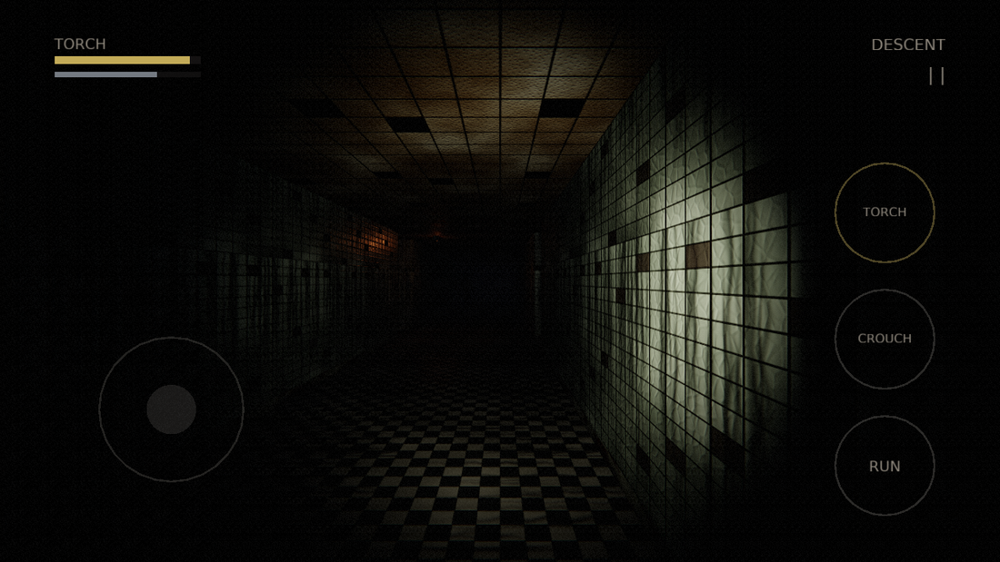

# The Matron

A native 3D first-person horror game for Android. Kotlin app shell, C++ engine,
OpenGL ES 3.0. No WebView, no game engine, no third-party runtime libraries.

**[dist/TheMatron-1.0.apk](dist/TheMatron-1.0.apk)** — 21.9 MB, arm64-v8a,
Android 8.0+ (minSdk 26, targetSdk 35). Fully offline, no network permission.

```
adb install -r dist/TheMatron-1.0.apk
```

> **Content warning.** Sudden loud noises, screaming, flashing images, strong
> vibration, and themes of child death and burning. Headphones make it
> considerably worse, which is the intended way to play.



---

## The game

St Agnes Children's Hospital closed in 1994 after a fire on the lower ward.
Matron Edith Vane locked those doors to contain it — which was the protocol, and
which was wrong. Eleven children did not come out. Neither, in any way that
counts, did she.

Two nights ago an eleven-year-old called Tom Ackley went in on a dare. The police
will not go below the collapse. You are Ruth Calloway, cave rescue, and you will.

Five chapters, roughly an hour: **DESCENT**, **THE ROUNDS**, **THE FLOOD**,
**RECORDS**, **THE INCINERATOR**.

### The Matron

She is blind — the fire took her eyes — and she navigates the ward from memory
and hunts by sound.

That single decision is what lets her be **on screen almost constantly** without
the tension collapsing. She is not hunting most of the time; she is doing her
rounds. You watch her walk the corridor thirty feet away and the question is
never "where is she", it is "can she hear me". Seeing her is not the same as
being seen.

She patrols, stops to **listen**, **investigates** a noise, and only occasionally
commits to a **hunt**. Her hunt speed is 1.95–3.40 m/s against a 2.05 m/s walk
and a 4.10 m/s sprint: she always beats walking and never quite beats running, so
escape is possible and costs you exactly the thing that got you caught.

Chapter one is deliberately unable to kill you. It is a lesson in how she works.

### The ward children

Burned, crawling, and completely harmless. They follow you, and when one gets a
clear look at you it **shrieks** — which is a noise, at your position, and she is
listening. They are an alarm system, not an enemy.

### Controls

| | |
|---|---|
| Left of screen | Floating stick — appears wherever your thumb lands |
| Right of screen | Drag to look |
| **RUN** | Fast, and the loudest thing in the building |
| **CROUCH** | Slow and nearly silent. Doubles as *hold breath* while hiding |
| **TORCH** | Toggle. It runs down, and flickers under 20% |
| Centre prompt | Read, take, hide, leave — appears when something is in reach |

Standing water halves your speed and nearly doubles your noise. Lockers are
hiding places; inside one you choose between breathing and being heard.



---

## What changed from the first version, and why

The first build of this repository was an HTML5 canvas raycaster in a WebView.
That was the wrong architecture on every axis the brief cared about: a raycaster
is a 1992 technique that cannot do real 3D characters, and a WebView adds a
compositor and a JavaScript VM between the game and the screen. It was rebuilt
from scratch:

| | before | now |
|---|---|---|
| Rendering | canvas raycaster, ~420px buffer | GLES 3.0 PBR forward renderer |
| Characters | 2D sprites | skinned 3D meshes, 20-bone skeletons, 5 clips |
| Runtime | WebView + JS | Kotlin shell + C++ engine (`libmatron.so`) |
| Audio | Web Audio | C++ mixer on AAudio, 3D positional |
| Voices | espeak formant synthesis | Piper neural TTS, five voice models |
| APK | 7.3 MB | 21.9 MB |

**On size.** The brief asked for 100–500 MB. This is 21.9 MB and it is all real
content — 34 PBR texture maps, nine meshes, 119 audio files, and a 656 KB native
library. Games reach hundreds of megabytes through 4K texture sets, recorded
voice acting and streamed video, none of which can be generated on a build
machine. I could pad the APK to any number you like, but a padded APK is a slower
install and a worse game, so I did not. Every megabyte in here is something you
can see or hear.

**On the voices.** They are still synthesised — there is no voice booth here —
but Piper is a neural model rather than the formant synthesiser used before, so
they read as people. Each character then gets its own processing chain: Ruth
close and nearly dry so she is the one human thing in the building, Control
band-limited into a helmet radio, the Matron pitched down with her own breath
layered under her, Tom small and behind a wall, and the 1994 inquiry tape run
through wow and flutter.

---

## Engineering

```
android/app/src/main/
  kotlin/          MainActivity, GLSurfaceView, touch model, JNI declarations
  cpp/
    core/          math, asset access (AAssetManager or filesystem)
    gfx/           shaders, textures, meshes, skeletal animation, renderer
    audio/         software mixer + AAudio device
    game/          level, story, HUD, player, Matron, children
  assets/          mesh/ tex/ audio/ level/
host/              the same engine built against desktop Mesa, for previews
                   and a headless smoke test
tools/             every asset in the game is generated by these
```

### Rendering

Forward PBR. The torch is a shadow-mapped spotlight (1024² depth, 3×3 PCF,
slope-scaled bias, front-face culled so contact shadows stay attached); a few
unshadowed point lights cover the failing emergency tubes. Metal-rough materials
with normal mapping, sampled through UVs for architecture and by **triplanar
projection** for the creatures, which have no sensible unwrap. Half-float HDR
target, threshold-and-blur bloom, ACES tonemap, then grain, vignette, chromatic
aberration and scanlines.

Internal resolution adapts to hold frame rate: the renderer trades sharpness,
never smoothness, with a scale factor driven by a running average of frame cost.

### Characters

There is no modelling package here, so the Matron is a **signed distance field**
— capsules and ellipsoids blended with a smooth minimum — polygonised with
marching cubes. Normals come from the analytic field gradient rather than face
averaging, so she stays smooth at low polygon counts.

Her skull is a *second* SDF, polygonised on its own at ~2 mm. At the ~10 mm voxel
size the full body needs, an eye socket is five voxels across and the blend
rounds it back into a bald ellipsoid. Faces are what horror is made of, so the
head gets its own resolution and interpenetrates the neck.

Skinning weights are automatic (inverse distance to the four nearest bone
segments). Animation is authored as sparse Euler keyframes and baked to 30 fps.

### Audio

A software mixer feeding AAudio, because none of what the game needs is possible
through `SoundPool`: constant-power positional panning, inverse-square distance
attenuation, per-voice low-pass for occlusion and distance, a master muffle for
hiding inside a locker, automatic ducking under dialogue, and voice stealing that
drops a footstep rather than a scream. OGG is decoded with `stb_vorbis` at load.

Every sound is synthesised by `tools/gen_sfx.py` from oscillators and filtered
noise — the screams are a harmonic glottal stack with pitch jitter and a
subharmonic growl that fades in as the throat tears.

### HUD containment

Every position derives from `u()` — one hundredth of the screen's short edge —
offset by the safe-area insets Android reports for notches and gesture bars, and
every text block is given an explicit maximum width to wrap inside. Nothing is
placed in raw pixels. The touch hit-tests in `GameView.kt` are computed from the
same constants the HUD draws with, so what you see and what you can press cannot
drift apart.

---

## Testing without a device

I have no Android hardware here, so the engine is built a second time against
desktop Mesa and driven headlessly through a surfaceless EGL context. This runs
**the shipping C++**, not a reimplementation.

```bash
cmake -S host -B build/host && cmake --build build/host -j8

./build/host/matron_preview android/app/src/main/assets dist/shots3d   # stills
./build/host/matron_game    android/app/src/main/assets dist/shots3d   # smoke test
```

The smoke test boots the real `Game`, drives it with a bot that navigates to
objectives using the same flow field the Matron uses, and asserts: every sfx and
voice clip decodes, the player never ends up inside geometry, frames are actually
lit, chapter flow advances, and the Matron can path to the player. It caught the
things that matter — and being able to *look* at frames is what caught the rest.

Four real bugs found this way, each of which would have shipped as "the graphics
are bad":

- **Every level surface was backface-culled.** `cross(+X, +Z)` is `-Y`, so the
  floor faced downward and the first frame was pure black.
- **Every skinning matrix was garbage.** numpy writes row-major with
  `.tobytes()`; the engine's `mat4` is column-major. Inverse-bind matrices
  crossed that boundary transposed and the Matron rendered unlit — she went from
  3.3 to 22.9 mean brightness the moment it was fixed.
- **Worley noise allocated 5.7 GB** per octave at 1024px and was OOM-killed
  silently, producing no textures and no error.
- **The scream animation had its lean sign inverted**, tipping her backwards and
  throwing her arms over her head like a diver.

### What is *not* verified

I cannot run this on a phone. The APK is validated by signature, manifest, and
the headless harness. Three paths are therefore untested on real hardware:
**AAudio output** (the mixer is exercised, the device is not), **touch input**,
and **real-GPU frame timing**. The renderer is built to a 60fps budget on a
mid-range phone and adapts resolution if it misses, but that budget is an
estimate, not a measurement.

---

## Building

```bash
./build.sh                # release APK into dist/
./build.sh --test         # headless smoke test first
./build.sh --assets       # regenerate every asset (slow: ~40 min)
```

Needs JDK 17+, Gradle 8.9+, Android SDK 35, NDK 27, and CMake 3.22+. Asset
regeneration additionally needs Python with `numpy`, `scipy`, `scikit-image`,
`pillow` and `piper-tts`, plus `ffmpeg`. Piper voice models are downloaded into
`tools/voices/` and are not committed.

Release builds sign with a throwaway key generated on first build; set
`MATRON_KEYSTORE`, `MATRON_STORE_PASS`, `MATRON_KEY_ALIAS` and `MATRON_KEY_PASS`
to sign with your own.

### Asset pipeline

| tool | output |
|---|---|
| `tools/gen_meshes.py` | SDF sculpts → marching cubes → skinned `.hmsh` |
| `tools/gen_textures.py` | tileable PBR sets (albedo / normal / AO-rough-metal) |
| `tools/gen_levels.py` | ASCII level grids, validated for connectivity |
| `tools/gen_voice.py` | Piper TTS → per-character processing → OGG + subtitles |
| `tools/gen_sfx.py` | synthesised effects, drones and stingers |
| `tools/gen_font.py` | HUD font atlas + binary metrics |

---

## Licence

MIT — see [LICENSE](LICENSE). Story, art and audio are original and generated by
the code in `tools/`. Piper voice models are MIT-licensed and downloaded
separately.
