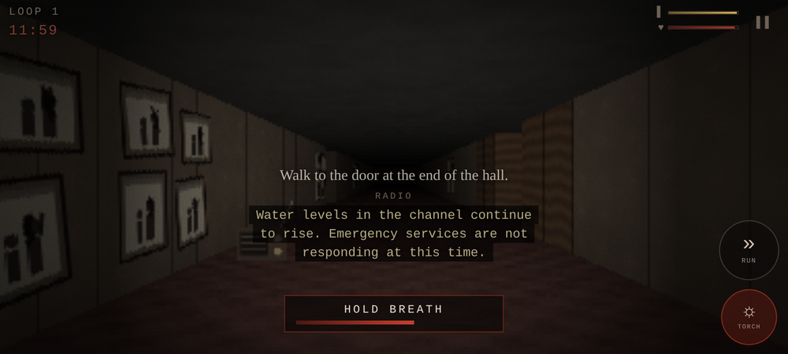
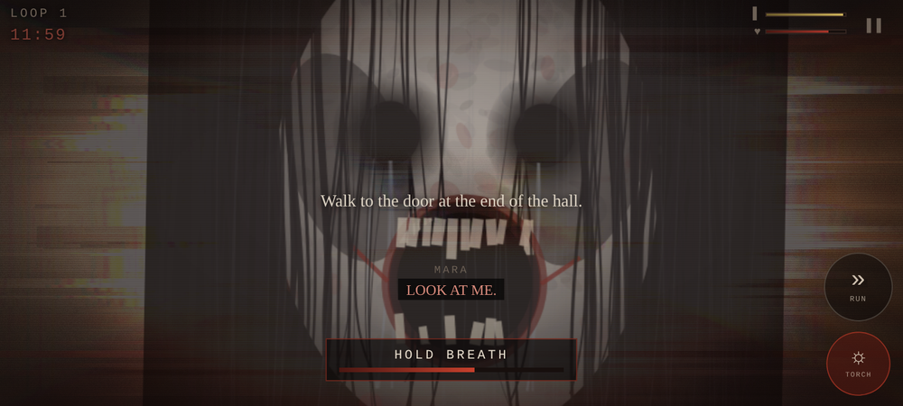

# The Ninth Loop

A first-person psychological horror game for Android. One corridor, nine times,
and it is never quite the same corridor twice.

**[dist/TheNinthLoop-1.0.apk](dist/TheNinthLoop-1.0.apk)** — 7.3 MB, Android 7.0+
(minSdk 24, targetSdk 35). Fully offline, no network permission, no analytics.

```
adb install -r dist/TheNinthLoop-1.0.apk
```

> **Content warning.** Sudden loud noises, screaming, flashing images, strong
> vibration, and themes of drowning, child death and drink-driving. There is a
> *Reduced flashing* option in the menu. Headphones make it considerably worse,
> which is the intended way to play.



---

## The game

You are Adam Vale. You wake on the eighth floor of Blackmoor Court, walk the
length of the hall, open the door at the end — and you are at the top of the hall
again. The clock says 11:59. It always says 11:59.

Each loop, the hall has changed a little. The photographs on the wall are not the
ones you passed last time. The bathroom door is open and you did not open it. The
water on the carpet is deeper than it was. A radio on the hall table is receiving
an emergency broadcast, then a news bulletin, then a hospital interview, and then
something that knows you are listening.

By loop five you are not alone in the hall. By loop eight the red door at the far
end is open, and the game stops being ambiguous about what happened on Blackmoor
Bridge. Loop nine asks you the only question it has been building to, and there
are two endings depending on how you answer it.

Roughly 45–70 minutes for a full run.

### Controls

| | |
|---|---|
| Left half of screen | Floating stick — appears wherever your thumb lands |
| Right half | Drag to look |
| **TORCH** | Toggle. It runs on a battery, and the battery runs out |
| **RUN** | Hold. Loud |
| **USE** | Appears when there is something to take, read, open or hide in |
| **HOLD BREATH** | Only while hiding. She can hear you |

Progress saves per loop. Back button pauses.

### Systems

- **Torch and battery.** ~2h45m of light per full cell, spare cells on the floor,
  fewer of them each loop. Below 18% it flickers.
- **Composure.** Drains in the dark and near her, recovers slowly in light.
  As it falls: the screen desaturates toward red, the vignette closes, your
  heartbeat gets louder and faster, breathing turns ragged, and the audio muffles
  as though your ears have stopped working properly.
- **Hiding.** Three closets. Get inside, hold your breath when she is close. Run
  out of air and you gasp, and she hears it.
- **Mara.** A state machine over a BFS flow field: she lurks where you will
  eventually look, stalks only while you are not watching, and hunts rarely and
  briefly — a monster that chases you constantly stops being frightening in about
  ninety seconds.



---

## What it was built from

The brief was to research the best horror games and take the good parts.

- **P.T. / Silent Hills** — the whole spine. The looping corridor, the liminal
  dread of a space suspended out of time, the clock frozen at 11:59, the slow
  escalation where each pass "chips away at your sanity, bit by agonising bit",
  and a player armed with nothing but a torch. The route here is a U so you can
  never see the whole corridor at once, which is what lets the hall change behind
  you.
- **Amnesia: The Dark Descent** — the composure meter, darkness as an active
  threat rather than a lighting choice, and no way to fight back.
- **Outlast** — the battery economy, and running as a loud, costly decision.
- **Silent Hill** — the radio as a diegetic narrator that degrades into something
  hostile.
- **Five Nights at Freddy's** — jump scares as a punishment for a mistake you can
  identify, not as random noise.
- **Layers of Fear** — rooms that rearrange themselves the moment you turn around.

The one rule followed throughout: **no more than one scare per loop lands without
warning.** Everything else is telegraphed seconds ahead and then delivered late.
Dread the player can see coming is worth more than surprise.

Sources:
[Dread Central](https://www.dreadcentral.com/editorials/435309/p-t-is-the-scariest-video-game-that-never-was/) ·
[NME](https://www.nme.com/features/the-irrefutable-horror-of-p-t-3229290) ·
[DualShockers](https://www.dualshockers.com/silent-hills-p-t-scariest-game-of-all-time/) ·
[Press Start, "Silent Halls: P.T., Freud, and Psychological Horror"](https://press-start.gla.ac.uk/press-start/article/view/121) ·
[Cinelinx](https://www.cinelinx.com/games/culture/exploring-horror-what-made-kojimas-p-t-silent-hills-so-scary/)

---

## How it is put together

A native Android shell hosting an HTML5 canvas engine. The APK is 7.3 MB and
carries no third-party libraries at all — not AndroidX, not a game engine, not a
single npm dependency at runtime.

```
android/app/src/main/
  java/…/MainActivity.java   immersive fullscreen, wake lock, vibration bridge,
                             and a local asset server (see below)
  assets/game/
    index.html  css/game.css
    js/  util · audio · textures · world · render · entity · input · story · ui · main
    audio/vo/    68 spoken lines
    audio/sfx/   40 synthesised sounds
tools/           asset generators + the headless test harness
```

### Rendering

A raycaster. The world is cast into a ~420×235 `Uint32Array`, then upscaled to
the panel — which is what lets a per-pixel-lit, floor-cast, sprite-composited
scene hold 60fps inside a WebView, and the softness of that upscale plus the film
grain over it is most of the look.

Lighting is three terms per pixel: flat ambient, the torch (an ellipse in screen
space falling off with distance), and exponential fog. Both ambient and fog are
per-loop, so the blackout at the top of loop four costs the player something real.
Floor casting runs on every other row. Standing water resamples the ceiling
texture through a ripple as a reflection. Resolution adapts down automatically if
frames get expensive, and the display backing store is area-capped so a 1440p
phone does not spend its whole frame compositing overlays.

Every texture, sprite and both scare faces are generated procedurally at boot —
value-noise fbm for the walls, canvas paths for the figures. There are no image
files in the APK except the launcher icon.

### Audio

There is no recorded audio in this project. Everything was synthesised offline by
`tools/`:

- **Voices** — `espeak-ng` provides a dry read, then each character goes through
  its own chain in `tools/audio_dsp.py`. Adam stays close and nearly dry so he
  reads as the only human in the game. The radio is band-limited to a speaker
  cone with carrier hiss, dropouts and tape flutter. Ellie is pitch-shifted up
  with a whispered take of the same words underneath, so she sounds further away
  than she is. Mara is three stacked takes — the voice, a sub an octave down, a
  whisper on top — ring-modulated and pushed through *reverse* reverb, so every
  line arrives slightly before she says it. Her three shouted lines skip the
  reverse reverb entirely: a jump scare must not telegraph itself.
- **Effects** — oscillators and filtered noise. The screams are a harmonic glottal
  stack with pitch jitter, a subharmonic growl that fades in as the throat tears,
  vowel formants, and a wavefolder; the music box is an inharmonic struck-bar
  timbre with tape wow.
- **Runtime** — a Web Audio graph with four buses, a shared convolution reverb, and
  a master lowpass that closes when you are hiding or coming apart. Assets are
  split by role: short one-shots are decoded into memory (~20 MB), long loops are
  streamed through `MediaElementAudioSourceNode`. Decoding everything would have
  cost well over 100 MB of PCM.

### The asset server

`MainActivity` serves `assets/game/**` over `https://appassets.androidplatform.net/`
rather than `file://`. A `file://` origin blocks `XHR`/`fetch`, which would make
`decodeAudioData` impossible and kill the entire audio pipeline. Requests to any
other host are refused outright — the game is completely offline. Audio is served
with an exact `Content-Length` and `Accept-Ranges: none`, because an interceptor
cannot answer the range requests the media stack would otherwise issue.

### UI containment

The brief asked specifically that the UI not overflow, so it is enforced
structurally rather than by eye. `html`, `body` and `#app` are fixed to the
viewport with `overflow: hidden`, so the page physically cannot scroll. Every
size derives from `--u` — one hundredth of the viewport's short side, set from JS
against `visualViewport`, because `vh`/`vw` go stale under Android's immersive
mode when the navigation bar hides. Notches are handled with
`env(safe-area-inset-*)`. Exactly one element is allowed to scroll, and only
vertically.

`tools/test_game.js` verifies this: it boots the real bundle in headless Chromium
at five deliberately hostile viewports — including a 640×300 landscape phone and a
forced portrait — forces the HUD into its busiest possible state (long subtitle,
long objective, breath bar and interact button all at once), and asserts that no
element's border box escapes the viewport and that the document cannot scroll.

---

## Building

```bash
./build.sh                # release APK into dist/
./build.sh --test         # run the headless test suite first
./build.sh --assets       # regenerate all audio and icons (slow)
```

Needs JDK 17+, Gradle 8.9+, and Android SDK platform 35 / build-tools 35. Asset
regeneration additionally needs `espeak-ng`, `ffmpeg`, and Python with
`numpy`, `scipy` and `pillow`.

The release build signs with a throwaway key generated on first build. Set
`NINTHLOOP_KEYSTORE`, `NINTHLOOP_STORE_PASS`, `NINTHLOOP_KEY_ALIAS` and
`NINTHLOOP_KEY_PASS` to sign with your own.

### Tests

```bash
node tools/test_game.js           # 55 checks across 5 viewports
node tools/test_game.js --quick   # boot + layout only
```

Covers: clean boot, layout containment, that the renderer produces a lit image,
movement and collision, jump-scare compositing, every event in all nine loops
executing without throwing, and a live render loop. Screenshots land in
`dist/shots/`.

---

## Licence

MIT — see [LICENSE](LICENSE). The story, audio and art are original work
generated by the code in `tools/`.
